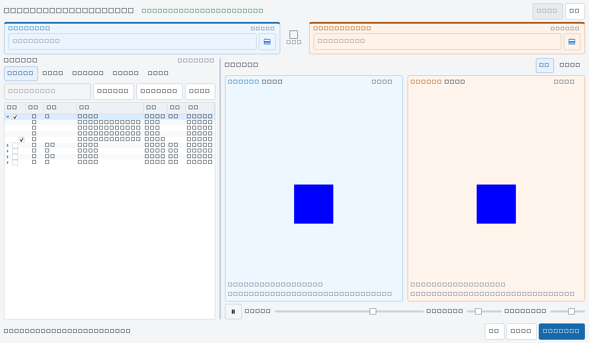

# MMY-ActionFileSync

[](https://github.com/yuyeming0115/MMY-ActionFileSync/actions/workflows/tests.yml)

面向动画序列素材的桌面同步工具，用于比较“新动作导出目录”和“SVN 工作目录”，同步预览两侧动画，并将用户明确勾选的动作文件从来源复制到目标。

项目使用 Python 和 PySide6，当前数据源为本地目录；SVN 适配器保留了后续扩展入口。



## 主要功能

- 固定显示“来源：新动作目录 → 目标：SVN 工作目录”，减少方向混淆。
- 来源使用浅蓝整框、目标使用浅橙整框；双预览画布保持相同中性背景。
- 以动作目录为主清单，聚合帧文件差异，避免全部帧长期铺满界面。
- 支持待更新、新增、内容变更、已一致和全部状态筛选。
- 支持搜索动作、全选当前结果、仅勾选有变更和清空选择。
- 支持使用 `Ctrl/Shift` 高亮多个动作，并通过空格批量勾选；方向快捷按钮一键勾选某方向下所有动作。
- 动作清单使用固定列 `选择 | 方向 | 目录 | 动作`，例如 `☑ | → | NW | idle`；同名动作垂直对齐，一致项使用 `=`，目标独有项使用 `SVN`。
- 支持展开动作后精确勾选或排除单个文件，父级显示三态选择。
- 来源和目标动画共享播放进度、帧滑杆、缩放和 Y 轴位移。
- 支持并排预览和差异闪烁预览。
- 传输前二次确认动作、文件、目标位置、覆盖状态和总大小。
- 使用文件内容哈希判断差异，复制完成后再次校验目标内容，避免时间戳误报和静默写入失败。
- 传输时显示总进度、当前文件、成功/失败统计和可展开日志。
- 开始传输时自动展开带时间戳的操作日志，完成后保留成功/失败结果。
- 日志使用标准配色：蓝色表示进行中，绿色表示完成，橙色表示警告，红色表示失败。
- 记忆窗口尺寸、分栏比例、最近目录和预览参数。
- 来源和目标目录在选择后立即持久化；清空当前界面不会遗忘最近目录，下次启动自动回填。

## 界面工作流

1. 选择来源“新动作目录”和目标“SVN 工作目录”。
2. 扫描完成后，在左侧动作差异清单中搜索或筛选动作。
3. 单击动作行，在右侧查看来源/目标同步动画。
4. 勾选整个动作，或展开动作后精确选择文件。
5. 检查底部选择摘要，点击“传输预览并开始”。
6. 在确认窗口中进行最后排除，然后开始传输。

扫描完成后默认不勾选任何文件，避免误覆盖目标目录。

## 状态含义

| 状态 | 含义 | 默认可传输 |
| --- | --- | --- |
| 新增待传 | 文件只存在于来源 | 是 |
| 内容变更 | 来源与目标的文件内容摘要不同 | 是 |
| 已一致 | 两侧一致 | 否 |
| 目标独有 | 文件只存在于目标 | 否；当前版本不会删除目标文件 |
| 无法判断 | 缺少足够信息 | 否 |

## 环境要求

- Windows 10/11
- Python 3.10+
- PySide6 6.8+

## 安装与运行

安装依赖：

```powershell
python -m pip install -r requirements.txt
```

启动应用（使用项目虚拟环境）：

```powershell
.venv\Scripts\python.exe -m main
```

## 测试

自动化单元测试（含不依赖 Qt 的模型/传输测试与 Qt 界面冒烟测试）：

```powershell
.venv\Scripts\python.exe -m unittest discover -s tests -v
```

启动应用做人工 UI 验证：

```powershell
.venv\Scripts\python.exe -m main
```

## 项目结构

```text
MMY-ActionFileSync/
├─ adapters/                 数据源适配器
├─ controllers/              UI 与后台任务编排
├─ models/                   树、动作差异、预览和传输模型
├─ services/                 扫描、比较、动作聚合、预览和传输服务
├─ views/                    PySide6 界面组件
├─ workers/                  扫描、预览和传输后台任务
├─ tests/                    自动化测试
├─ 开发文档/                 UI 方案、计划和变更记录
├─ main.py                   应用入口
└─ requirements.txt          Python 依赖
```

## 设计与开发文档

- [UI 重构开发计划](开发文档/MMY-ActionFileSync_UI重构开发计划.md)
- [UI 重构方案报告](开发文档/MMY-ActionFileSync_UI重构方案报告.html)
- [预览算法说明](preview_algorithm.md)

## 安全边界

- 传输方向固定为来源到目标。
- 当前版本会新增或覆盖选中的目标文件，不会删除目标独有文件。
- 传输前会显示最终文件清单，用户可取消整个动作或单个文件。
- 覆盖目标文件时保留新的写入时间，不再把目标修改时间重置为来源时间。
- 工具不会自动执行 SVN 提交或推送。

## 开源协议

本项目使用 [MIT License](LICENSE)。允许个人和商业项目使用、修改与分发，但必须保留原版权和许可声明；软件按原样提供，不附带担保。
